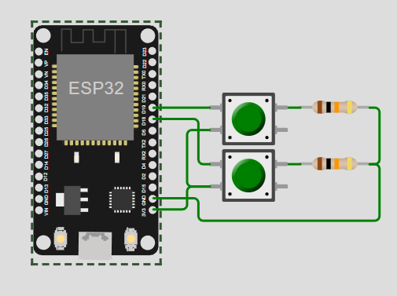
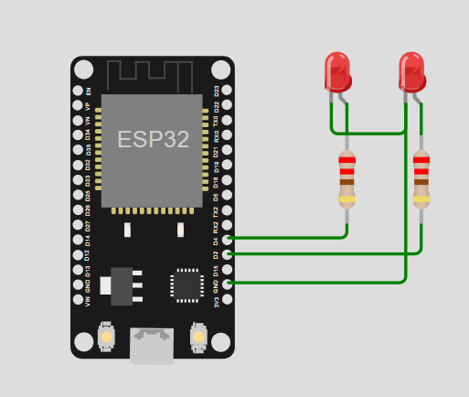

# waterflow-monitoring
Project two ESP32 each connected to the server **(PHP + MYSQL)** where the first ESP32 has a button then the second ESP32 has lights with HTTP communication and simple API,, if the button on the first ESP is pressed then the lights on the second ESP will turn on if pressed again will turn off, and so on..

# Wiring Diagram
## ESP32 - 1 as data sending device
<picture>
  
</picture>

## ESP32 - 2 as data collection device
<picture>
  
</picture>

# Installation
Use ```git clone https://github.com/arifnurrizqi/ESP32-Wireless-Control.git``` or Download this repository in zip form

## Configuration Server on localhost

then follow these steps:
1. Install xampp
2. Run & start apache + mysql
3. Copy and extract the script file in the xampp/htdocs folder
4. Create database in PhpMyAdmin : localhost/phpmyadmin
Example here: esp_waterflow
5. Open the extracted script folder in xampp/htdocs
6. Open the config.php file
8. Change the database name, the same as the new database name in step 4:

Example here: esp_waterflow
```
$servername = "localhost";
$dbname = "wireless_control";
$username = "root";
$password = "";
```

9. Import the web database to phpmyadmin
10. After the database is imported. The web is ready to run on localhost with the address: localhost/NAMEFOLDER
example here: localhost/ESP32-Wireless-Control


## Configuration Microcontroller ESP32
then follow these steps:
1. Install Arduino IDE 2.0, download on https://www.arduino.cc/en/software
2. Install board ESP32 on your Arduino IDE, follow this tutorials https://randomnerdtutorials.com/installing-esp32-arduino-ide-2-0/
3. Install some library like HTTPClient, I2C for LCD display (optional)
4. Open the esp_waterflow.ino file which is in the esp_waterflow folder in the Arduino Ide application
5. change your SSID on line 20, wifi password on line 21 which is still on the same network as your computer for localhost, also change the server name on line 24
6. If all the configurations above are successful, you can then upload the program to the ESP32 by selecting the board according to the board you are using. Don't forget to select the serial port, make sure the ESP32 is connected to your computer.

## Note*
To configure web hosting, the method is more or less the same or you can follow the following tutorial, because this is a development from there
https://randomnerdtutorials.com/visualize-esp32-esp8266-sensor-readings-from-anywhere/

## Demo
<a href="https://wokwi.com/projects/395668880280322049"> For Demo First ESP32 Click Here</a> <br>
<a href="https://wokwi.com/projects/395693819976632321"> For Demo Second ESP32 Click Here</a>
